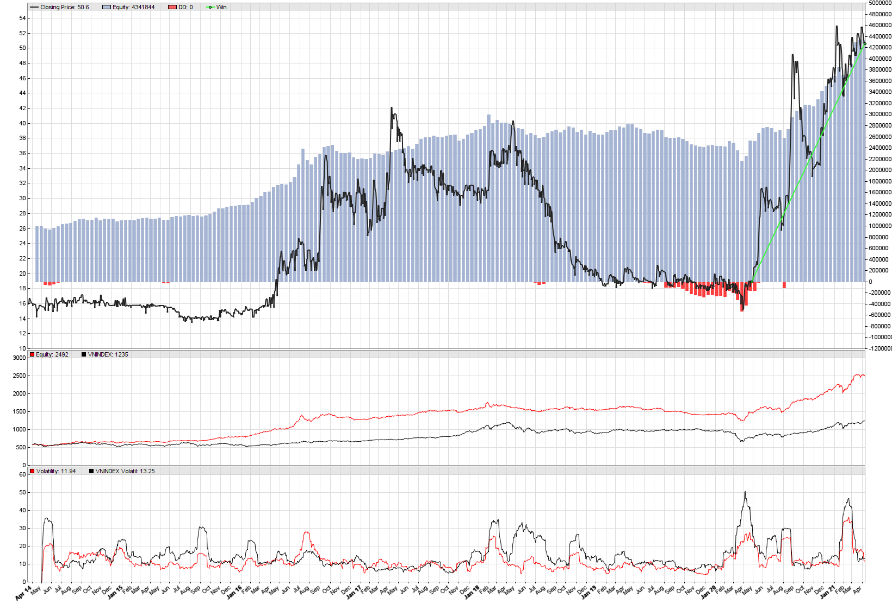

# AI đầu tư giá trị

> 9/4/2021 by AIAI Cafe

Trong đầu tư chứng khoán, chắc hẳn ai cũng từng nghe qua về đầu tư giá trị, tức là mua cổ phiếu của một doanh nghiệp tốt với mức giá hợp lý. Nhưng làm thế nào để xác định một doanh nghiệp là tốt và mức giá nào là hợp lý thì không hề dễ dàng. Trong bài nghiên cứu này, nhóm AIAI Cafe sẽ sử dụng phương pháp khoa học dữ liệu để tìm câu trả lời cho vấn đề trên.

## Dữ liệu thị trường

Chúng ta sử dụng dữ liệu của thị trường chứng khoán Việt Nam, với khoảng 1600 mã cổ phiếu trên sàn. Đối tượng dữ liệu bao gồm dữ liệu tài chính doanh nghiệp được báo cáo hàng quý và hàng năm, dữ liệu về giá giao dịch hàng ngày của các cổ phiếu tương ứng.

## Vấn đề 1: báo cáo tài chính bị xào nấu

Chúng ta thấy gì từ báo cáo tài chính của doanh nghiệp, chúng ta tin những gì mà báo cáo công bố đến đâu. Câu chuyện về [Enron](https://en.wikipedia.org/wiki/Enron) cho chúng ta thấy dữ liệu báo cáo tài chính có thể được xào nấu nhiều đến mức nào.

Với hàng nghìn doanh nghiệp được niêm yết trên sàn chứng khoán, làm sao chúng ta phân biệt được báo cáo của doanh nghiệp nào là sát với thực tế hơn? Câu trả lời lại là một mô hình toán học được chạy trên chiếc máy tính của chúng ta.

Trong bài báo [The Detection of Earnings Manipulation](https://www.researchgate.net/publication/252059255_The_Detection_of_Earnings_Manipulation), tác giả Beneish đã đưa ra một mô hình toán học giúp chúng ta định lượng được mức độ xào nấu báo cáo. Kết quả của mô hình cũng được khẳng định ở một số bài báo khác như [Application of Beneish M-Score Models and Data Mining to Detect Financial Fraud](https://www.researchgate.net/publication/286530544_Application_of_Beneish_M-Score_Models_and_Data_Mining_to_Detect_Financial_Fraud) của Herawati.

Sử dụng mô hình Beneish M-Score, chúng ta sẽ loại bỏ những doanh nghiệp có xác suất xào nấu báo cáo cao khỏi danh sách.

## Vấn đề 2: doanh nghiệp bị phá sản

Có một vấn đề đối với cổ phiếu giá trị, đó là nó bị lẫn với những cổ phiếu mà doanh nghiệp sắp phá sản, đặc biệt khi thị giá của nó xuống rất thấp. Vậy làm sao để chúng ta tránh mua phải những cổ phiếu như vậy? Câu trả lời một lần nữa lại đến từ một mô hình toán học.

Trong bài báo [Predicting Financial Distress and the Performance of Distressed Stocks](https://www.researchgate.net/publication/228205085_Predicting_Financial_Distress_and_the_Performance_of_Distressed_Stocks), các tác giả John Campbell, Jens Hilscher và Jan Szilagyi đã đưa ra mô hình xác suất dựa trên 8 yếu tố giá trị của báo cáo tài chính.

Sử dụng mô hình này, chúng ta tiếp tục loại bỏ những doanh nghiệp có xác suất phả sản cao ra khỏi danh sách.

## Vấn đề 3: định giá

Việc định giá chưa bao giờ là chuyện dễ dàng. Một số công cụ hay được sử dụng như **P/E**, **P/B** rất dễ bị làm sai lệch.

Ở đây, nhóm sẽ sử dụng thước đo **EBITDA/TEV**, với những lý do sau:

* EBITDA: phản ánh khả năng bán hàng của doanh nghiệp, loại bỏ đi các cách ghi báo cáo tài chính, giúp các con số khó bị xào nấu hơn
* TEV: thay cho giá trị trường, để loại bỏ đi việc sử dụng đòn bẩy nợ của doanh nghiệp (như trong chỉ số P/E)

Tuy nhiên, để làm nghiên cứu, nhóm cũng sử dụng các chỉ số P/E, P/B và EBITDA/TEV để so sánh hiệu quả thực sự của những chỉ số này.

Và tất nhiên, chúng ta sẽ loại bỏ những doanh nghiệp được định giá cao ra khỏi danh sách cổ phiếu giá trị của mình.

## Vấn đề 4: chất lượng tài chính doanh nghiệp

Sau khi đã chọn được cổ phiếu có giá hợp lý, chúng ta cần thêm một bước nữa, đó là chọn cổ phiếu của doanh nghiệp tốt. Ở đây chúng ta đo mức độ tốt của doanh nghiệp dựa trên mô hình thang điểm tài chính.

Trong bài báo [Value Investing: The Use of Historical Financial Statement Information to Separate Winners from Losers](https://www.semanticscholar.org/paper/Value-Investing%3A-The-Use-of-Historical-Financial-to-Piotroski/0559e92e06dae21e77ea79d79417b8a1d40be772), tác giả Piotroski đã đưa ra một mô hình chấm điểm tài chính doanh nghiệp dựa trên 9 tiêu chuẩn được chia làm 3 nhóm. Mô hình mang tên Piotroski F-score.

Dựa trên mô hình này, chúng ta sẽ loại bỏ doanh nghiệp có điểm thấp ra khỏi danh sách đầu tư giá trị.

## Vấn đề 5: giải ngân vốn và quản lý đầu tư

Với cách làm trên, chúng ta sẽ có được danh sách cổ phiếu giá trị hàng năm. Từ danh sách này, chúng ta thực hiện đầu tư phân bổ vốn vào các cổ phiểu dựa trên tính thanh khoản, mức độ rủi ro dự báo của từng cổ phiếu.

Kết quả kiểm nghiệm đầu tư theo phương pháp giá trị, với dữ liệu từ 2014 đến nay:

## Kết luận

* Những mô hình toán học có khả năng giúp chúng ta đầu tư theo nguyên tắc giá trị
* Dựa trên kết quả kiểm nghiệm, hiệu suất của danh mục đầu tư là vượt trội so với mặt bằng chung của thị trường (đại diện là VNINDEX) trong giai đoạn 7 năm nay
