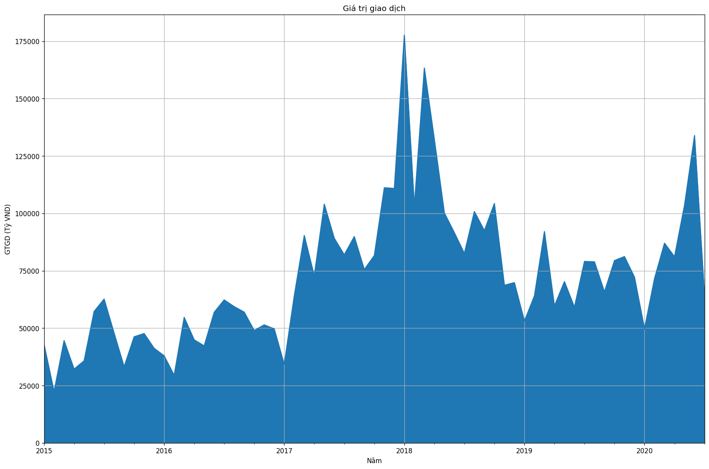
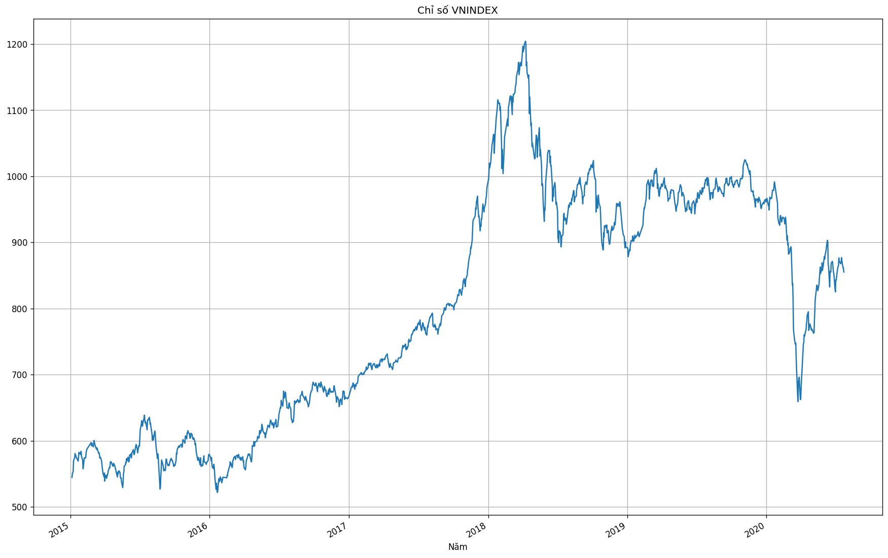
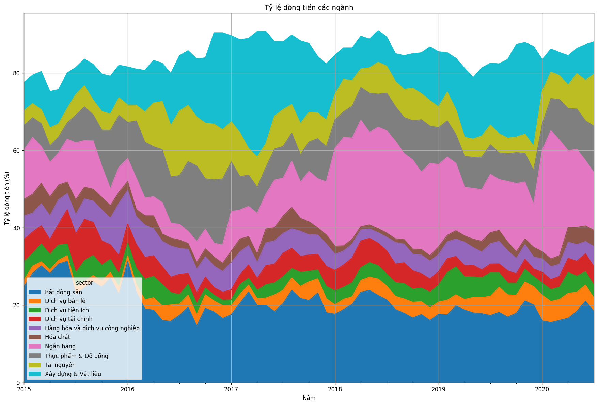
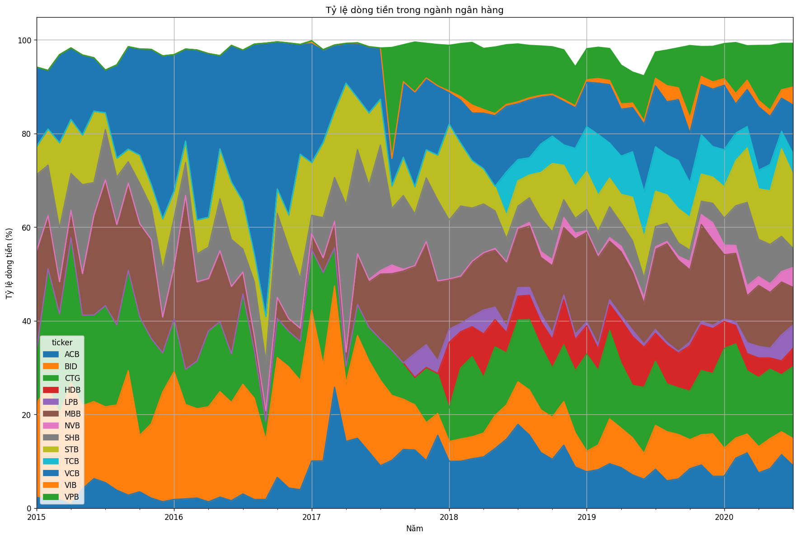
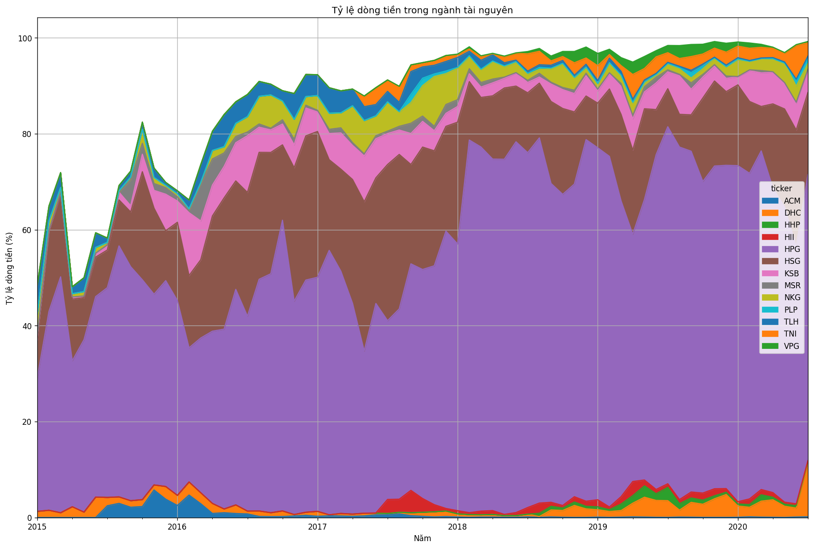

# Dòng tiền thị trường

> 22/7/2020 by AIAI Cafe

Trong giai đoạn vừa qua chúng ta nghe nói nhiều đến việc nhà đầu tư F0 tham gia vào thị trường chứng khoán đã tạo ra một đợt tăng giá mạnh hồi tháng 4, tháng 5. Còn dữ liệu thị trường nói gì? Chúng ta cùng xem xét dữ liệu dòng tiền trên thị trường.

## Cách thức đo dòng tiền

Chúng ta sử dụng giá trị giao dịch (tính bằng Tỷ VND) để do độ lớn của dòng tiền. Ví dụ, trong phiên toàn bộ thị trường giao dịch 4,000 Tỷ thì chúng ta nói rằng dòng tiền vào thị trường là 4,000 Tỷ.

## Dòng tiền trên toàn bộ thị trường

Cùng quan sát dữ liệu của toàn bộ thị trường từ năm 2015 đến nay theo biểu đồ sau

Có thể thấy, vào đầu năm 2018 giá trị giao dịch đạt đến đỉnh điểm trên 175,000 Tỷ/tháng, tương ứng với giai đoạn chỉ số VNINDEX tăng lên rất cao (trên 1,200).

Và trong những tháng gần đây, chúng ta cũng thấy một hiện tượng tương tự. Khi mà thanh khoản của thị trường lại tăng lên rất nhiều (trên 175,000 Tỷ/tháng). Cũng là thời điểm mà chỉ số VNINDEX có đợt phục hồi lịch sử từ 650 lên 900. Để đi sâu hơn, chúng ta cùng phân tích thêm về dòng tiền đổ vào các ngành theo thời gian lịch sử.

## Dòng tiền theo ngành

Để tiện theo dõi, chúng ta sẽ chỉ lấy ra các ngành có mức dòng tiền tương đối lớn (đại diện cho 80% dòng tiền toàn bộ thị trường)

Bất động sản và ngân hàng đang là những ngành hút dòng tiền nhiều nhất trên TTCK Việt Nam. Trong đó tỷ lệ của ngành BĐS được giữ ở mức tương đối ổn định trong một khoảng thời gian dài. Dữ liệu cho thấy ngành ngân hàng đang bị giảm tỷ lệ dòng tiền trong những tháng từ đầu năm 2020 trở lại đây. Đối ngược lại là ngành tài nguyên có tỷ lệ dòng tiền được gia tăng trong những tháng gần đây. Chúng ta cùng đi sâu vào xem xét kỹ lưỡng hơn ở 2 ngành này.

## Ngành ngân hàng

Dữ liệu cho thấy việc phân bổ dòng tiền vào các mã chứng khoán ngành ngân hàng khá là đồng đều và tương đối ổn định qua các thời kì.

## Ngành tài nguyên

Với ngành tài nguyên, dòng tiền lại phân bố không đồng đều và mức độ thay đổi cũng lớn qua các năm. Riêng 2 mã chứng khoán đã hút phần lớn dòng tiền đầu từ vào ngành này.

## Kết luận

* Chúng ta thấy được một cách khái quát về dòng tiền đầu tư vào TTCK trong vòng 5 năm trở lại đây
* Giai đoạn đầu 2018 và đầu 2020 là 2 giai đoạn có dòng tiền lớn trong vòng 5 năm trở lại đây
* Ngành bất động sản và ngân hàng vẫn là 2 ngành được quan tâm, thu hút dòng tiền nhiều nhất
* Dòng tiền vào ngành ngân hàng khá ổn định, trong khi đó dòng tiền vào ngành tài nguyên lại lệch về một số mã nổi bật trong ngành
