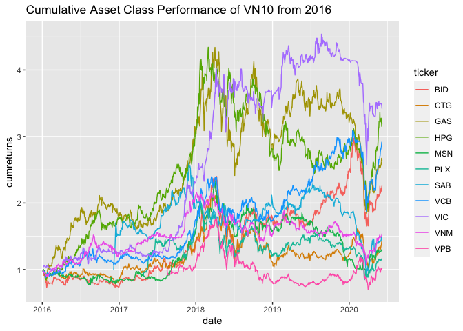

Thị trường chứng khoán Việt Nam trong khủng hoảng COVID-19 dưới góc nhìn dữ liệu
================================================================================

Thị trường chứng khoán Việt Nam vừa trải qua một đợt giảm giá sâu và
phục hồi nhanh chưa từng có trong lịch sử 20 năm qua. Chúng ta cùng nhìn
lại thị trường với đại diện là rổ VN30 và các chứng khoán liên quan đến
rổ cổ phiếu này. Cùng xem dữ liệu nói lên điều gì!?

Lợi nhuận
---------

Yếu tố đầu tiên phải kể đến là mức sinh lợi (return) của cổ phiếu trong
giai đoạn khủng hoảng vừa qua.

Chỉ số VN30 cùng với các hợp đồng tương lai phái sinh từ nó cho thấy một
đợt sụt giảm đồng thuận từ tháng 2 đến cuối tháng 3. Từ đầu tháng 4 đến
nay, chúng đều tăng trưởng ngoạn mục với sự dẫn dắt của VN30, theo sau
là các hợp đồng 1 tháng, 2 tháng, 1 quí, 2 quí. Có điều việc tăng trưởng
của các hợp đồng bị phân kì với các mức basic lớn cho các hợp đồng dài
hạn hơn. Riêng quĩ E1VFVN30 được giao dịch khá sát với chỉ số VN30 trong
giai đoạn vừa qua.

### So sánh giữa hai giai đoạn

Để có cái nhìn rõ hơn, chúng ta cùng so sánh dữ liệu thị trường trong
giai đoạn trước và sau khủng hoảng. Chúng ta chọn ngày 6/3/2020 (ngày Hà
Nội công bố ca bệnh đầu tiên) làm mốc trước và sau khủng hoảng.

Mọi thứ có vẻ vẫn diễn ra bình thường, thị trường vẫn có những biến động
đi ngang trong vòng hơn một năm qua.

Nhưng từ sau ngày này, mức sinh lợi của thị trường giảm mạnh rồi bật
tăng trở lại về mốc tham chiếu. Mức sinh lợi trong giai đoạn này có vẻ
tương đương với giai đoạn trước khủng hoảng? Và tính chất thị trường
không thay đổi? Để trả lời cho câu hỏi này, chúng ta cần xem xét đến một
biến số khác của dữ liệu là mức độ biến động (volatility) của thị
trường.

Mức độ biến động
----------------

Chúng ta có thể thấy mức độ biến động thị trường trong khủng hoảng là
lớn hơn hẳn giai đoạn trước đó (trên 20%). Và đạt đến đỉnh điểm khi mức
độ biến động xấp xỉ 50%. Riêng quĩ ETF mô phỏng VN30 bị tác động mạnh
hơn, với mức biến động cao hơn VN30 khoảng 10% trong khủng hoảng.

Một số mã trong VN30
--------------------

Cùng nhìn xa hơn về quá khứ với một số mã chứng khoán (được lựa chọn
ngẫu nhiên) trong rổ VN30.

Chúng ta thấy giai đoạn đi ngang của thị trường được bắt đầu từ giữa năm
2018 với hầu hết các mã được lựa chọn đều đi ngang. Ngoại trừ hai mã
thuộc ngành ngân hàng (VCB, BID) có được mức performance tốt hơn thị
trường chung.

Khi nhìn dữ liệu từ năm 2016, chúng ta thấy được mức độ phân kì
performance của các mã rõ ràng hơn.

### So sánh hai giai đoạn của một số mã trong VN30

Chúng ta vẫn lấy ngày 6/3 làm mốc so sánh.

Trong giai đoạn trước khủng hoảng, các mã được chọn có performance tương
đối khác nhau, biểu hiện bằng việc phân kì về phía bên phải dữ liệu.
Việc chọn mã có vai trò lớn đối với performance đầu tư.

Tuy nhiên trong giai đoạn sau khủng hoảng, các mã chứng khoán đều đồng
loạt tăng và giảm với các mức performance không quá khác xa nhau.

Để làm rõ hơn, chúng ta so sánh thêm về mức độ biến động (volatility) và
độ xiên (skew) của các mã trước và sau khủng hoảng.

Mức độ biến động tăng lên một cách rõ rệt với hầu hết các mã.

Độ xiên của các mã thì hầu hết bị lệch về phía âm, ngoại trừ mã MSN có
thay đổi dương trong khủng hoảng.

Toàn diện hơn nữa, chúng ta cùng xem xét đến hàm phân phối của mức sinh
lợi hàng ngày đối với các mã.

Điều rõ ràng nhất được thấy ở đây là hàm phân phối hầu như thay đổi hoàn
toàn về tính chất. HPG, VCB thay đổi với mức độ dao động rộng hơn nhưng
nghiêng về phía dương (tăng). MSN và VIC là những mã cho thấy ít sự thay
đổi nhất.

Kết luận
--------

-   Mức độ biến động của chỉ số VN30 vẫn cao (15-20%) và đang giảm từ
    đỉnh vào hồi đầu tháng 4. Khủng hoảng đã thực sự qua đi?
-   Hàm phân phối biến động lợi nhuận là khác hẳn sau sự kiện COVID-19
-   Mức sinh lợi của các mã trong rổ VN30 là rất thấp kể từ năm 2018
-   Mức độ biến động đang giảm dần từ đầu tháng 4 đối với các mã được
    xem xét
-   Mức độ hồi phục của các mã đang dần tiến về mức trước khủng hoảng
    (cả về giá và độ biến động)
-   Thị trường phục hồi hình chữ V thể hiện tinh thần lạc quan của nhà
    đầu tư trước nền kinh tế Việt Nam
